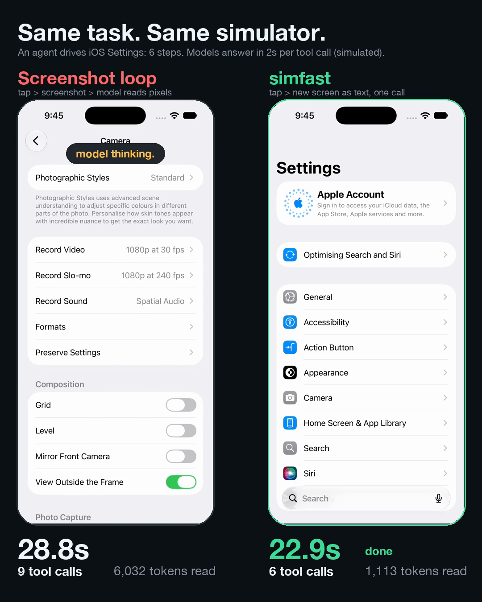

# simfast

**Fast, token-cheap iOS Simulator control for AI agents.** Read the screen as ~300 tokens of text instead of a 1.5k-token screenshot, tap in ~100 ms through a persistent daemon, and get the new screen back from every action so an agent needs one tool call per step instead of two.

Works as a CLI (great with Claude Code and any agent that has a shell) and as an MCP server (Claude Desktop, Cursor, Codex, …).

```text
$ simfast tap General
tapped "General" (Button) at (201,406)
[Settings] 12 elements · screen changed
0	Button	Settings	(38,84)
1	Heading	General	(201,84)
2	Heading	General	(72,254)
3	Heading	Manage your overall setup and preferences for iPhone, such as softwar…	(199,315)
4	Button	About	(201,434)
5	Button	Screen Capture	(201,521)
6	Button	AutoFill & Passwords	(201,608)
7	Button	Dictionary	(201,660)
8	Button	Fonts	(201,712)
9	Button	Keyboard	(201,764)
10	Button	Language & Region	(201,816)
11	Button	Trackpad	(201,868)
· 1.5s via simgadget (act 0.1 · settle 0.5 · read 0.9)
```

[](docs/simfast-demo.mp4)
*Click for the 47 s side-by-side video (real tool time; model latency simulated at 2 s per tool call). Reproduce with `demo/record.mjs` + `demo/compose.py`.*

## Why

Most agent-driven simulator loops look like this: *tap → screenshot → model reads pixels → guess coordinates → tap*. That is slow and expensive for three reasons:

1. **Two tool calls per step** (act, then look), and every call is a model round trip.
2. **Images are token-heavy**: a full-screen screenshot is ~1,500 tokens, and the model still has to guess coordinates from pixels.
3. **Each tap spawns a process** (~0.9 s with AXe) and the raw accessibility tree is huge (600 KB, ~175k tokens for one real app screen), so nobody feeds it to the model.

simfast fixes each of them:

| Problem | What simfast does |
|---|---|
| Reading the screen | `axe describe-ui` → flattened to on-screen, deduplicated, labelled elements (**~10-50 lines**). Drops layout containers, scroll bars, off-screen items, and the image/text children that repeat their parent button's label. |
| Slow taps | A per-simulator daemon keeps [SimGadget](https://github.com/zafnz/simgadget)'s `idb_companion` warm: **~0.1 s per tap**, with the 0.1 s press floor that makes taps land reliably. |
| Two calls per step | Every action returns the *new* screen and whether it **changed**. One call = one step. |
| Known paths | `simfast do "tap General" "tap About" …` runs many steps and reads the screen **once**. |

## Benchmark

Same 6-step Settings flow (General → About → back → Settings → Camera → back), iPhone 17 simulator, iOS 27.0, Xcode 27.1, Apple silicon. Median of 6 runs. [`bench/compare.mjs`](bench/compare.mjs) reproduces it.

| | Tool time | Tool calls (model round trips) | Observation tokens |
|---|---|---|---|
| Screenshot loop (tap, then screenshot) | 13.2 s | 12 | ~9,000 |
| simfast, one call per step | 10.5 s | 6 | ~1,100 |
| simfast, whole flow in one `do` | **7.3 s** | **1** | **~230** |

Reading it honestly:

- **Tool time only.** LLM thinking time is *not* measured. It is dominated by the number of round trips and tokens, which is where simfast wins most: with a (made-up) 3 s per model turn the totals are ~49 s / ~29 s / ~13 s. Plug in your own with `--llm-seconds`.
- The screenshot loop is given the benefit of the doubt: a reliable held touch for taps, and 0.4 s per step for the transition to finish. Image tokens are estimated as `w×h/750` after resizing to a 1568 px long edge.
- Per-step simfast is only ~20 % faster in raw tool time: reading the accessibility tree (~0.5-1 s) costs about what a screenshot does. The savings are in tokens and round trips.
- Variance is real: in one of six batched runs a slow SimGadget accessibility read pushed it to 27 s (see [Known issues](#known-issues)).

## Install

Requirements: macOS on Apple silicon, Xcode with a simulator runtime, Node 18+, and [AXe](https://github.com/cameroncooke/AXe).

```bash
brew install cameroncooke/axe/axe
npm install -g github:iamxicor/simfast      # once on npm: npm install -g simfast
simfast doctor
```

`simfast doctor` checks everything and tells you what to fix. SimGadget is an *optional* dependency: without it simfast still works, with taps through AXe (~0.9 s each) instead of ~0.1 s. On first use SimGadget downloads a pinned, SHA-256-verified `idb_companion` (~19 MB) from its GitHub releases into `~/Library/Caches/simgadget`.

## Use it from the shell (Claude Code, scripts, any agent with Bash)

Boot a simulator, then:

```bash
simfast launch com.apple.Preferences      # launch an app, print its first screen
simfast see                               # what is on screen right now
simfast tap "General"                     # by label (case-insensitive, prefix/substring)
simfast tap 3                             # by index from the latest listing
simfast tap 120,340                       # by coordinates
simfast tap Search --type TextField       # restrict to an element type
simfast type "hello" --submit             # type, then press Return
simfast scroll down                       # reveal content below
simfast do "tap General" "tap About"      # several steps, one screen read at the end
simfast shot /tmp/screen.png              # screenshot: only for visual checks
```

With several simulators booted, pass `--udid <UDID>` or set `SIMFAST_UDID`.

### Teach Claude Code to use it

Copy the bundled skill so Claude Code reaches for simfast instead of screenshots:

```bash
mkdir -p ~/.claude/skills && cp -r skills/simfast ~/.claude/skills/
```

### Step reference

| Step | Meaning |
|---|---|
| `tap <label \| index \| x,y>` | Flags: `--type Button`, `--count 2` (double tap), `--long`, `--no-see`, `--confirm` |
| `type <text>` | Type into the focused field; `--submit` presses Return |
| `key return\|tab\|backspace\|escape\|space` | Keyboard keys (or a HID keycode) |
| `scroll up\|down\|left\|right` | Content direction: `scroll down` reveals what is below |
| `swipe up\|down\|left\|right` | Raw finger direction |
| `button home\|lock\|siri\|side-button` | Hardware buttons |
| `launch <bundle-id>` / `open <url>` | Launch an app / open a URL or deep link |
| `wait <ms>` | Pause (useful inside `do`) |

In `do`, use labels, not indexes: the screen changes after the first step. A batch stops at the first failed step and prints the screen where it stopped, so the agent can recover. When the target is not on screen yet (a page still sliding in), `tap` waits up to ~1.2 s for it to appear.

### Reading the output

```text
[Settings] 12 elements · screen changed       <- app, element count, did the last action change anything
0	Button	Settings	(38,84)                <- index, type, label, centre point
...
off-screen: 8 down (swipe to reveal)           <- how much is hidden and where
· 1.4s via simgadget (act 0.1 · settle 0.5 · read 0.8)
```

`screen UNCHANGED` after an action is the most useful signal an agent gets: it means the tap did not do what was expected.

## Use it as an MCP server

```bash
# Claude Code
claude mcp add simfast -- npx -y github:iamxicor/simfast mcp
```

Other clients (Cursor, Claude Desktop, …):

```json
{ "mcpServers": { "simfast": { "command": "npx", "args": ["-y", "github:iamxicor/simfast", "mcp"] } } }
```

Tools: `screen`, `tap`, `type_text`, `scroll`, `swipe`, `key`, `button`, `launch_app`, `open_url`, `batch`, `screenshot`. The whole schema is ~5.5 KB (~1.6k tokens) of context. The server starts the daemon immediately so the warm-up overlaps with the model thinking.

## How it works

```text
  agent ──(CLI or MCP)──> simfast client ──unix socket──> daemon (one per simulator)
                                                              │
              read: axe describe-ui ──> flatten ──> compact text + changed flag
              act : SimGadget gRPC ──> warm idb_companion ──> HID input (~0.1 s)
                    (falls back to AXe if SimGadget is not installed)
```

- `src/snapshot.js`: pure, unit-tested flattening of the AXe tree (`npm test`).
- `src/engine.js`: the step grammar, label resolution, settle and wait logic.
- `src/daemon.js`: idle for 30 min (`SIMFAST_IDLE_MIN`) then exits and releases the companion.

Label resolution is deliberately defensive. SimGadget's on-device "first match wins" lookup can pick the wrong element (an app named *Settings* also matches a Back button labelled *Settings*), so simfast resolves against the snapshot it last showed the agent, and uses the device lookup only for stale screens and only when the match is a real control. Switches go through SimGadget's accessibility activation, because a switch's frame spans its whole row.

## Configuration

| Variable | Default | |
|---|---|---|
| `SIMFAST_UDID` | the only booted simulator | Target simulator |
| `SIMFAST_SETTLE_MS` | `500` | Wait after an action before reading (300 ms caught 1 of 24 screens mid-transition, 500 ms caught 0 of 24) |
| `SIMFAST_CONFIRM` | `0` | `1` = re-read changed screens until two reads agree (slower, safer for slow animations) |
| `SIMFAST_IDLE_MIN` | `30` | Daemon idle timeout |
| `SIMFAST_NO_SIMGADGET` | unset | `1` = use AXe only |

Daemon logs: `/tmp/simfast-<uid>/<udid-prefix>.log`. Stop one with `simfast stop`.

## Known issues

These are real, observed while building this, not hypothetical.

- **The accessibility tree can be wrong.** On iOS 27's Settings app, the *Accessibility* page reports the previous page's list behind it and an unlabelled back arrow. The text listing is a *claim about* the screen, not the screen. If it looks stale or does not match your expectation, take one screenshot (`simfast shot`). The tool descriptions and bundled skill tell agents to do this.
- **Plain `axe tap` did not register** in my tests on iOS 27.0 / AXe 1.8.0: 0 of 26 taps landed (plain `axe tap` 0/16 with and without the companion running; `--tap-style physical` 0/10), while a 0.1 s held touch landed 10 of 10. simfast always holds the touch ≥ 0.1 s (SimGadget's documented floor; the AXe fallback uses `axe touch --delay`). Your results may differ with other versions.
- **Cold starts.** The first command after the daemon starts waits for the companion (~10 s). The very first run on a machine also downloads the companion and may take ~50 s while the accessibility bridge installs. The first label lookup in a freshly launched app takes ~3 s.
- **Intermittent slow reads.** SimGadget's on-device accessibility reads occasionally take 3-4 s (I saw it once on a real app and once as a 27 s batched run). simfast reads the tree with AXe, so only label lookups on stale screens are exposed. `SIMFAST_NO_SIMGADGET=1` avoids it.
- **`button home`** returns a slow, near-empty listing: the SpringBoard tree is large and mostly unlabelled.
- Simulators only (no physical devices), macOS on Apple silicon only.

## How it relates to other tools

- [AXe](https://github.com/cameroncooke/AXe): the accessibility reader and fallback input. simfast is a layer on top.
- [SimGadget](https://github.com/zafnz/simgadget) / `simgadget-mcp`: the fast-tap engine, and a full MCP of its own. simfast adds the compact snapshot, the act-and-observe loop, batching and defensive label resolution. (In my tests SimGadget's own `ui_describe_all` returned ~2k-token nested JSON and sometimes took 3 s+, which is why simfast reads with AXe.)
- [idb](https://fbidb.io/), [XcodeBuildMCP](https://github.com/cameroncooke/XcodeBuildMCP), [Maestro](https://maestro.mobile.dev/): broader or flow-oriented tools; simfast is narrowly about the agent's inner loop.

## Contributing

Issues and PRs welcome, especially: other iOS versions' tap/tree behaviour, more tree-flattening heuristics (with a fixture in `test/`), and an Android emulator backend. `npm test` runs the unit tests; `npm run bench -- --udid <UDID>` the benchmark.

## License

MIT. Built on AXe (MIT, Cameron Cooke), SimGadget (MIT, zafnz) and idb_companion (MIT, Meta).
